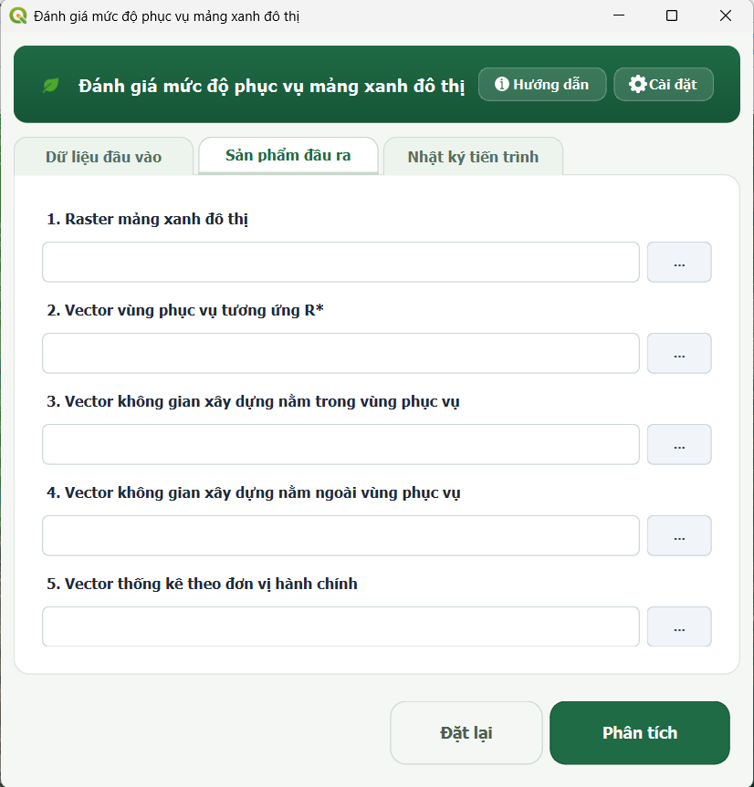
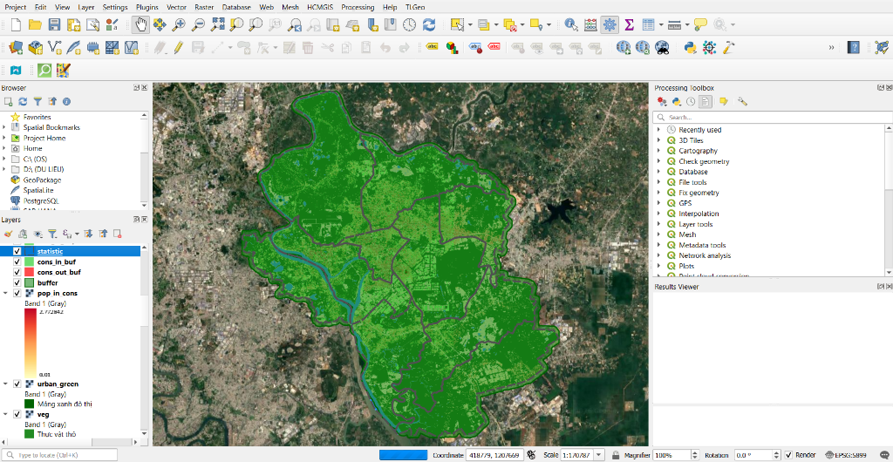

# Chạy phân tích

Trang này hướng dẫn từng bước quy trình thực thi phân tích trên Plugin **Green Space Evaluator**, từ bước nạp dữ liệu, cấu hình tham số, thực thi chuỗi xử lý gồm 5 module cho đến kiểm tra các sản phẩm kết quả trên giao diện QGIS.

---

## 1. Trước khi bắt đầu

Trước khi thực hiện, hãy đảm bảo bạn đã chuẩn bị đầy đủ dữ liệu và hiểu rõ các tham số đánh giá:

- [x] Đã chuẩn bị đủ 5 nhóm dữ liệu theo hướng dẫn tại [Dữ liệu đầu vào](du-lieu-dau-vao.md).
- [x] Lớp khu vực nghiên cứu đã được chuyển đổi về hệ tọa độ phẳng (Projected CRS, đơn vị mét).
- [x] Nắm rõ ý nghĩa các ngưỡng kỹ thuật tại [Cài đặt tham số](tham-so.md).

---

## 2. Mở Plugin

Người dùng có thể mở giao diện Plugin theo một trong hai cách trên thanh công cụ QGIS:

1. **Từ thanh bảng chọn**: Vào menu **Plugins** → **Urban Green Space Service Evaluator** → chọn **Đánh giá mức độ phục vụ mảng xanh đô thị**.
2. **Từ thanh công cụ**: Nhấn trực tiếp vào biểu tượng **chiếc lá** trên thanh công cụ của QGIS.

Cửa sổ chính của Plugin sẽ xuất hiện với 3 thẻ chức năng: *Dữ liệu đầu vào*, *Sản phẩm đầu ra*, và *Nhật ký tiến trình*.

---

## 3. Chọn dữ liệu đầu vào

Tại thẻ **Dữ liệu đầu vào**, tiến hành chọn lần lượt 5 nhóm dữ liệu theo đúng thứ tự trên giao diện:

<div class="guide-figure" markdown>

<div class="guide-caption"><strong>Hình 1.</strong> Giao diện nạp dữ liệu đầu vào của Plugin</div>
</div>

1. **Các kênh ảnh Sentinel-2**: Nhấn nút **`...`** để mở hộp thoại chọn kênh. Tích chọn các layer ảnh đang mở trong QGIS hoặc nhấn *Thêm file từ ổ đĩa* để nạp tối thiểu 4 kênh bắt buộc (**B03, B04, B08, B11**); có thể thêm **B02** và **SCL** nếu có.
2. **Raster dân số WorldPop**: Chọn layer raster mật độ dân số WorldPop tương ứng trong danh sách thả xuống (hoặc nhấn `...` để duyệt file GeoTIFF từ máy tính).
3. **Vector khu vực nghiên cứu**: Chọn layer polygon ranh giới khu vực nghiên cứu (đóng vai trò là khung tham chiếu không gian).
4. **Vector công viên/vườn hoa**: Chọn layer polygon công viên, vườn hoa mẫu hiện hữu trong khu vực.
5. **Vector dấu vết công trình xây dựng**: Chọn layer polygon đại diện cho không gian xây dựng (Google Open Buildings, OSM hoặc tương đương).

---

## 4. Thiết lập tham số

Nếu cần thay đổi các chỉ tiêu quy hoạch hoặc ngưỡng viễn thám so với cấu hình thử nghiệm mặc định ($R_{max} = 300\text{ m}$, $C_{min} = 6\text{ m}^2/\text{người}$, $S_{min} = 5000\text{ m}^2$, SAVI tự động `P10`):

- Nhấn nút **Cài đặt** (biểu tượng bánh răng) ở góc trên bên phải giao diện chính để mở cửa sổ cấu hình nâng cao.
- Xem hướng dẫn chi tiết về cách lựa chọn giá trị phù hợp tại trang [Cài đặt tham số](tham-so.md).
- Nhấn **OK** để lưu cấu hình hoặc **Đặt lại** nếu muốn quay về giá trị ban đầu.

---

## 5. Chọn sản phẩm đầu ra

Chuyển sang thẻ **Sản phẩm đầu ra** để chỉ định đường dẫn lưu cho 5 sản phẩm chính:

<div class="guide-figure" markdown>

<div class="guide-caption"><strong>Hình 2.</strong> Giao diện chỉ định nơi lưu các sản phẩm đầu ra chính</div>
</div>

1. **1. Raster mảng xanh đô thị** (định dạng `.tif`).
2. **2. Vector vùng phục vụ tương ứng R\*** (định dạng `.gpkg`, `.shp` hoặc `.geojson`).
3. **3. Vector không gian xây dựng nằm trong vùng phục vụ** (định dạng `.gpkg`, `.shp` hoặc `.geojson`).
4. **4. Vector không gian xây dựng nằm ngoài vùng phục vụ** (định dạng `.gpkg`, `.shp` hoặc `.geojson`).
5. **5. Vector thống kê theo đơn vị hành chính** (định dạng `.gpkg`, `.shp` hoặc `.geojson`).

!!! tip "Cơ chế tạo lớp tạm thời"
    Nếu người dùng **để trống đường dẫn**, Plugin sẽ tự động tạo các tệp kết quả tạm thời (Temporary Layers) trong thư mục tạm của hệ thống và tự động nạp lên phiên làm việc QGIS. Khuyến nghị chỉ định thư mục lưu mới để tránh bị khóa tệp khi ghi đè các sản phẩm cũ đang mở.

---

## 6. Chạy phân tích

Sau khi hoàn tất việc chọn dữ liệu và đường dẫn đầu ra, nhấn nút **Phân tích** ở thanh điều khiển phía dưới.

Thuật toán sẽ tự động kích hoạt chuỗi xử lý liên hoàn qua 5 module:

```
[Module 1: Tiền xử lý] ➔ [Module 2: Chỉ số phổ & Mảng xanh] ➔ [Module 3: Vùng phục vụ R*] ➔ [Module 4: Không gian xây dựng] ➔ [Module 5: Thống kê Phường/Xã]
```

- **Module 1**: Chuẩn hóa dữ liệu Sentinel-2 và WorldPop theo phạm vi, hệ tọa độ và độ phân giải của khu vực nghiên cứu.
- **Module 2**: Tính MNDWI, SAVI và trích xuất lớp mảng xanh.
- **Module 3**: Xác định bán kính phục vụ \(R^*\) dựa trên khoảng cách Euclid và điều kiện sức tải.
- **Module 4**: Phân loại các khối công trình xây dựng nằm trong vùng phục vụ (Intersects) và nằm ngoài vùng phục vụ (Disjoint).
- **Module 5**: Chạy Zonal Statistics liên hoàn theo đơn vị hành chính, tính toán 6 chỉ số định lượng và xuất file báo cáo.

---

## 7. Theo dõi tiến trình và nhật ký

Khi nhấn **Phân tích**, Plugin sẽ tự động chuyển sang thẻ **Nhật ký tiến trình**:

- **Khóa an toàn giao diện**: Nút *Phân tích* và *Đặt lại* sẽ tạm thời bị vô hiệu hóa; thuật toán thực thi ngầm qua luồng phụ (Worker Thread) giúp QGIS không bị treo đơ.
- **Thanh tiến trình (Progress Bar)**: Thanh tiến trình: Hiển thị mức độ hoàn thành của quá trình xử lý.
- **Khung nhật ký (Log)**: Ghi nhận chi tiết từng bước xử lý, thời gian thực thi, các giá trị thống kê trích xuất và kết quả bán kính $R^*$.
- **Nút điều khiển nhật ký**: Người dùng có thể nhấn **Sao chép log** để lưu vào bộ nhớ tạm hoặc **Lưu log** để xuất file `.txt`.
- **Nút Hủy**: Trong quá trình đang chạy, người dùng có thể nhấn nút **Hủy** ở thanh điều khiển dưới cùng để dừng tiến trình phân tích một cách an toàn.

---

## 8. Khi quá trình hoàn tất

Khi toàn bộ quá trình xử lý kết thúc thành công:

<div class="guide-figure" markdown>

<div class="guide-caption"><strong>Hình 3.</strong> Nhật ký tiến trình thông báo đã hoàn thành chuỗi xử lý.</div>
</div>

**Checklist xác nhận hoàn thành:**

- [x] Thanh tiến trình đạt `100%` và hộp thoại thông báo *Thành công* xuất hiện.
- [x] Khung log hiển thị bảng tổng kết thời gian thực thi của 5 module.
- [x] Các lớp kết quả được tự động nạp lên danh sách lớp (Layers Panel) của QGIS.
- [x] Kiểu dáng hiển thị (QML Styles) được tự động gán đồng bộ: mảng xanh màu xanh lá đậm, vùng phục vụ màu xanh ForestGreen trong suốt, công trình thiếu xanh màu đỏ tươi.

<div class="guide-figure" markdown>

<div class="guide-caption"><strong>Hình 4.</strong> Các lớp kết quả được nạp tự động lên giao diện QGIS kèm kiểu dáng trực quan.</div>
</div>

---

## 9. Kiểm tra sản phẩm đầu ra

| Sản phẩm đầu ra | Loại dữ liệu | Nội dung / Vai trò kỹ thuật |
|---|---|---|
| **Mảng xanh đô thị** | Raster (GeoTIFF) | Lớp thực vật mảng xanh tổng hợp (trong công viên + ngoài công viên đã lọc diện tích) |
| **Vùng phục vụ tương ứng R\*** | Vector (Polygon) | Phạm vi không gian đệm bán kính lớn nhất $R^*$ thỏa mãn điều kiện sức tải mục tiêu |
| **Không gian xây dựng được phục vụ** | Vector (Polygon) | Các polygon công trình xây dựng nằm trong vùng phục vụ $R^*$ |
| **Không gian xây dựng thiếu mảng xanh** | Vector (Polygon) | Các polygon công trình xây dựng nằm ngoài vùng phục vụ |
| **Thống kê theo đơn vị hành chính** | Vector (Polygon) | Lớp ranh giới tích hợp 6 trường dữ liệu định lượng (`T_DanSo`, `S_MangXanh`, `TL_ThieuXanh`,...) |
| **File báo cáo thống kê** | File Excel / CSV | Bảng số liệu tổng hợp chi tiết theo từng phường/xã phục vụ lập biểu mẫu báo cáo |

👉 Xem chi tiết cấu trúc các trường dữ liệu và sản phẩm trung gian tại trang [Sản phẩm & chỉ tiêu thống kê](san-pham.md).

---

## 10. Nếu xảy ra lỗi

Nếu quá trình phân tích không thành công, hãy kiểm tra khung **Nhật ký tiến trình** và rà soát các nguyên nhân thường gặp:

1. **Thiếu thư viện Python phụ thuộc**: Kiểm tra thông báo trong Nhật ký tiến trình và môi trường Python của QGIS. Không tự ý cài thư viện vào Python hệ thống nếu chưa xác định đúng môi trường mà QGIS đang sử dụng.
2. **Thiếu kênh ảnh Sentinel-2 bắt buộc**: Đảm bảo danh sách kênh đã chọn chứa đủ các kênh B03, B04, B08, B11.
3. **Lớp ranh giới nghiên cứu chưa chuẩn hóa**: Kiểm tra hệ tọa độ của lớp khu vực nghiên cứu (phải là Projected CRS, đơn vị mét) và kiểm tra lỗi hình học (valid geometry).
4. **Không trích xuất được mẫu công viên**: Xảy ra khi polygon công viên nằm ngoài phạm vi ảnh hoặc toàn bộ diện tích công viên bị gán NoData; hãy kiểm tra lại vị trí công viên hoặc chuyển sang chế độ *Ngưỡng SAVI thủ công* trong phần Cài đặt.
5. **Xung đột / Khóa tệp đầu ra**: Đảm bảo file kết quả cũ (đặc biệt là file Excel/CSV hoặc GeoPackage) không bị mở khóa trong phần mềm khác khi đang chạy phân tích.
