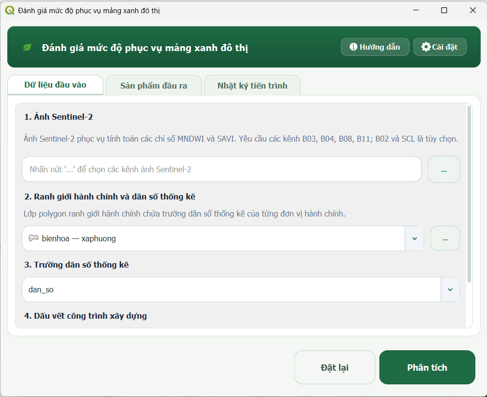
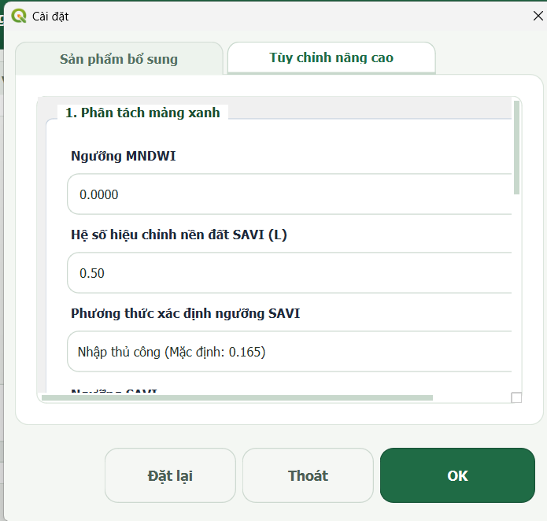
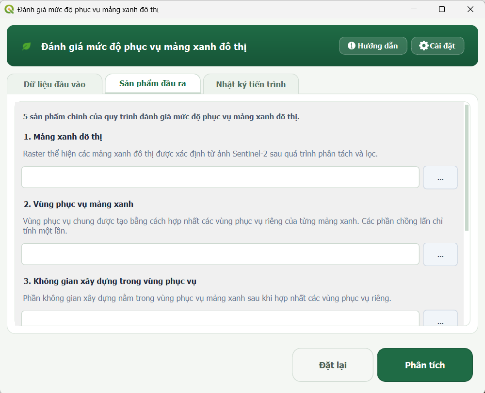
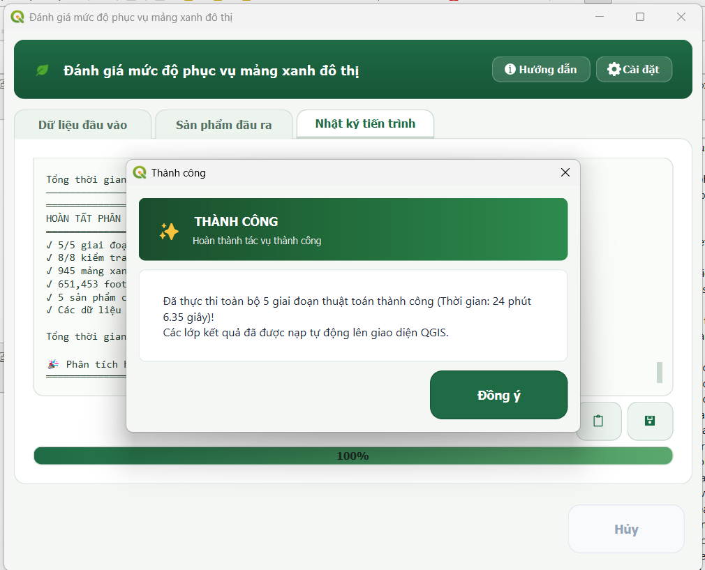

# Chạy phân tích

Trang này hướng dẫn chi tiết từng bước thực thi quy trình phân tích trên Plugin **Green Space Evaluator**, cấu hình cửa sổ Cài đặt, theo dõi nhật ký tiến trình và kiểm tra các kết quả đầu ra trên giao diện QGIS.

---

## 1. Các bước thực hiện tổng quan

```
[BƯỚC 1: Nạp dữ liệu đầu vào] ➔ [BƯỚC 2: Kiểm tra tham số] ➔ [BƯỚC 3: Chọn nơi lưu sản phẩm] ➔ [BƯỚC 4: Nhấn "Phân tích"]
```

---

## 2. Mở Plugin

Người dùng có thể mở giao diện Plugin trên QGIS theo một trong hai cách:

1. **Từ menu**: Vào **Plugins** → **Urban Green Space Service Evaluator** → chọn **Đánh giá mức độ phục vụ mảng xanh đô thị**.
2. **Từ thanh công cụ**: Nhấn trực tiếp vào biểu tượng **chiếc lá** trên thanh công cụ của QGIS.

Cửa sổ chính của Plugin hiển thị 3 tab chức năng:
- **Dữ liệu đầu vào**: Nạp dữ liệu ảnh Sentinel-2, ranh giới hành chính kèm trường dân số thống kê và dấu vết công trình xây dựng.
- **Sản phẩm đầu ra**: Chỉ định đường dẫn lưu trữ cho 5 sản phẩm chính và bảng báo cáo bổ sung.
- **Nhật ký tiến trình**: Theo dõi tiến độ, thông báo và tổng kết thời gian thực thi.

---

## 3. Thao tác tại tab Dữ liệu đầu vào

Tại thẻ **Dữ liệu đầu vào**, nạp các dữ liệu cần thiết:

<div class="guide-figure" markdown>

<div class="guide-caption"><strong>Hình 1.</strong> Giao diện nạp dữ liệu đầu vào của Plugin</div>
</div>

1. **Các kênh ảnh Sentinel-2**: Nhấn nút **`...`** để mở hộp thoại chọn kênh. Tích chọn các layer ảnh đang mở trong QGIS hoặc nhấn *Thêm file từ ổ đĩa* để nạp tối thiểu 4 kênh bắt buộc (**B03, B04, B08, B11**); có thể thêm **B02** và **SCL** nếu có.
2. **Ranh giới hành chính và dân số thống kê**:
   - Chọn layer polygon ranh giới hành chính trong danh sách thả xuống.
   - Tại ô chọn trường dân số, chọn trường thuộc tính chứa số liệu dân số thống kê chính thức của từng đơn vị hành chính. Plugin sẽ tự động chuẩn hóa nội bộ thành trường `POP_STAT`.
3. **Dấu vết công trình xây dựng (Footprint)**: Chọn layer polygon công trình xây dựng đại diện cho không gian xây dựng vật lý.

---

## 4. Cửa sổ Cài đặt

Nhấn nút **Cài đặt** (biểu tượng bánh răng ở góc trên bên phải) để mở cửa sổ cấu hình gồm 2 tab:

<div class="guide-figure" markdown>

<div class="guide-caption"><strong>Hình 2.</strong> Giao diện cấu hình trong cửa sổ Cài đặt của Plugin</div>
</div>

### Tab 1: Sản phẩm bổ sung
- Cho phép người dùng chỉ định đường dẫn lưu trữ các sản phẩm bổ sung nếu có nhu cầu lưu trữ tệp riêng để phục vụ nghiên cứu hoặc kiểm tra chất lượng (ví dụ: `OUT_BUFFER` - vùng phục vụ riêng của từng mảng xanh, Sentinel-2 Stack, MNDWI, SAVI, Mặt nước, Bảng thống kê mảng xanh).
- Nếu để trống, các sản phẩm bổ sung sẽ được tự động tạo dưới dạng tệp tạm thời trong thư mục tạm của hệ điều hành (`tempfile.gettempdir()`) và nạp vào phiên làm việc.

### Tab 2: Tùy chỉnh nâng cao
- Thiết lập các tham số kỹ thuật: Ngưỡng MNDWI (`0.000`), Hệ số SAVI $L$ (`0.50`), Ngưỡng SAVI nhập thủ công (`0.165`), Diện tích mảng xanh tối thiểu ($A_{\min} = 5000\text{ m}^2$), Bán kính phục vụ tối đa $R_{\max}$ (`300 m`), Chỉ tiêu diện tích mảng xanh tối thiểu $C_{\min}$ (`6.0 m²/người`), Bước tìm kiếm bán kính $\Delta d$ (`50 m`), Ngưỡng hội tụ dân số $e$ (`1.0 người`).
- Nhấn **OK** để lưu hoặc **Đặt lại** để quay về giá trị mặc định ban đầu.

---

## 5. Thao tác tại tab Sản phẩm đầu ra

Chuyển sang thẻ **Sản phẩm đầu ra** để chỉ định đường dẫn lưu:

<div class="guide-figure" markdown>

<div class="guide-caption"><strong>Hình 3.</strong> Giao diện chỉ định nơi lưu 5 sản phẩm đầu ra chính</div>
</div>

### 5 sản phẩm đầu ra chính:
1. **Mảng xanh đô thị** (Raster, `.tif`).
2. **Vùng phục vụ mảng xanh** (Vector Polygon, `.gpkg`, `.shp` hoặc `.geojson`).
3. **Không gian xây dựng trong vùng phục vụ** (Vector Polygon, `.gpkg`, `.shp` hoặc `.geojson`).
4. **Không gian xây dựng ngoài vùng phục vụ** (Vector Polygon, `.gpkg`, `.shp` hoặc `.geojson`).
5. **Thống kê kết quả theo đơn vị hành chính** (Vector Polygon, `.gpkg`, `.shp` hoặc `.geojson`).

### Bảng báo cáo thống kê bổ sung:
- **Bảng thống kê theo đơn vị hành chính** (tùy chọn định dạng `.xlsx` hoặc `.csv`).

!!! tip "Cơ chế tạo tệp kết quả tạm thời"
    Nếu người dùng **để trống đường dẫn**, Plugin sẽ tự động tạo các tệp kết quả tạm thời trong thư mục tạm của hệ điều hành (`tempfile.gettempdir()`) và nạp trực tiếp lên bản đồ QGIS. Khuyến nghị người dùng chỉ định đường dẫn lưu mới để tránh bị khóa tệp khi ghi đè các sản phẩm cũ đang mở.

---

## 6. Chuỗi thực thi 5 Module

Khi nhấn nút **Phân tích**, thuật toán chạy ngầm qua Worker Thread không gây đơ giao diện QGIS theo chuỗi 5 module:

```
[Module 1: Chuẩn bị dữ liệu] ➔ [Module 2: Phân tách mảng xanh] ➔ [Module 3: Vùng phục vụ riêng R*] ➔ [Module 4: Vùng phục vụ chung SERVICE_UNION] ➔ [Module 5: Thống kê Hành chính]
```

- **Module 1 (Tiền xử lý và chuẩn hóa dữ liệu):**
  - Kiểm tra tính hợp lệ hình học các lớp vector.
  - Chuẩn hóa trường dân số thống kê thành `POP_STAT`.
  - Tiếp nhận hệ tọa độ phẳng dự chiếu tham chiếu (mét) và tạo ảnh Sentinel-2 Stack 10 m.
- **Module 2 (Chỉ số phổ và phân tách mảng xanh):**
  - Tính MNDWI và phân tách mặt nước (ngưỡng 0.000).
  - Tính SAVI ($L = 0.50$) và bóc tách thực vật (ngưỡng 0.165).
  - Lọc bỏ mảng xanh nhỏ manh mún (< 5000 m²).
  - Phân tích liên thông 8-lân cận tạo các mảng xanh độc lập, gán `PATCH_ID` và vector hóa thành `green_patches`.
- **Module 3 (Xác định bán kính phục vụ riêng $R^*$):**
  - Phân chia footprint công trình theo đơn vị hành chính tạo các footprint-part và phân bổ dân số không gian `POP_ALLOC`.
  - Xây dựng chỉ mục không gian `QgsSpatialIndex` dùng chung cho toàn bộ tập footprint-part.
  - Xác định dân số phục vụ tối đa $P_{\max, i} = S_i / C_{\min}$.
  - Xác định bán kính khả thi $R^*$ cho từng mảng xanh qua phương pháp tìm kiếm hai giai đoạn (khoanh vùng nghiệm theo bước $\Delta d = 50\text{ m}$ và tinh chỉnh nhị phân theo ngưỡng hội tụ dân số $e = 1.0\text{ người}$).
  - Tạo vùng phục vụ riêng `OUT_BUFFER` cho từng mảng xanh.
- **Module 4 (Phân tích không gian xây dựng):**
  - Hợp nhất Unary Union các vùng phục vụ riêng thành vùng phục vụ mảng xanh chung (`SERVICE_UNION`), loại bỏ đếm lặp vùng chồng lấn.
  - Phân tích giao cắt hình học giữa `SERVICE_UNION` và các footprint-part.
  - Phân rã thành các phần diện tích xây dựng nằm trong vùng phục vụ (`SERVED`) và ngoài vùng phục vụ (`OUTSIDE`).
  - Phân bổ dân số nguồn `SOURCE_POP_ALLOC` cho từng phần diện tích xây dựng thành `POP_FRAGMENT` theo tỷ lệ diện tích thực tế.
- **Module 5 (Tổng hợp và thống kê kết quả):**
  - Tổng hợp trực tiếp từ các lớp vector kết quả ra 10 trường chỉ số định lượng theo từng đơn vị hành chính.
  - Tự động thực thi hệ thống 8 phép kiểm tra cân bằng dữ liệu (Balance Checks).
  - Xuất 5 sản phẩm đầu ra chính và bảng số liệu báo cáo (Excel/CSV).

---

## 7. Hệ thống 8 phép kiểm tra tính toàn vẹn dữ liệu (Balance Checks)

Plugin tích hợp cơ chế tự động kiểm tra đối soát số liệu khắt khe bằng giá trị thực độ chính xác cao (Raw Full-Precision) trước khi kết thúc:

1. **Cân bằng dân số toàn cục (Global Population Balance)**: Tổng dân số phân bổ trên các phần diện tích xây dựng bằng đúng tổng dân số thống kê ban đầu của đơn vị hành chính ($\sum \text{raw_T_DanSo} = \sum \text{raw_D_DaPhucVu} + \sum \text{raw_D_ThieuXanh}$).
2. **Cân bằng dân số theo phường (Ward-level Population Balance)**: Dân số được phân bổ trong từng phường khớp chính xác với tổng dân số phục vụ và thiếu xanh của phường đó.
3. **Cân bằng diện tích xây dựng theo phường (Ward Area Balance)**: Tổng diện tích xây dựng được phục vụ và diện tích xây dựng thiếu xanh bằng đúng tổng diện tích xây dựng của phường/xã.
4. **Cân bằng tổng diện tích không gian xây dựng (Global Area Balance)**: Tổng diện tích các phần diện tích xây dựng `SERVED` và `OUTSIDE` sau khi phân cắt bằng đúng tổng diện tích footprint nguồn đầu vào ($|\Delta A| \le 0.01\text{ m}^2$).
5. **Cân bằng diện tích mảng xanh gốc (Green-space Area Balance)**: Tổng diện tích mảng xanh phân bổ cho các đơn vị hành chính khớp với tổng diện tích mảng xanh gốc trong phạm vi ranh giới hành chính.
6. **Cân bằng dân số vùng phục vụ (Service Union Population Balance)**: Kiểm tra tính nhất quán giữa tổng dân số phục vụ cấp phường ($\sum \text{raw_D_DaPhucVu}$) và tổng `POP_FRAGMENT` của lớp `SERVED` toàn cục. Đồng thời ghi nhận lượng dân số bị đếm lặp nếu chỉ cộng rời rạc các vùng phục vụ riêng `OUT_BUFFER`.
7. **Kiểm tra tính đầy đủ footprint-part đầu vào (Footprint-part Completeness)**: Kiểm tra toàn bộ footprint-part đầu vào được bảo toàn khi phân chia thành `SERVED` và `OUTSIDE`, không bị thiếu hoặc phát sinh phần tử ngoài tập đầu vào ($\text{Unique}(\text{SERVED} \cup \text{OUTSIDE}) \equiv \text{Input Footprint Parts}$).
8. **Tính đầy đủ và hợp lệ logic thuộc tính (Attribute Logic)**: Kiểm tra tất cả các chỉ tiêu thuộc tính nằm trong miền giá trị hợp lệ (tỷ lệ 0-100%, diện tích $\ge 0$, dân số $\ge 0$).

---

## 8. Theo dõi tiến trình và nhật ký

Trong quá trình thực thi, tab **Nhật ký tiến trình** cập nhật liên tục với 5 nhóm ký hiệu chuẩn:

- `ℹ` **Khởi động / Thông tin:** Thông báo trạng thái cấu hình và thông tin kỹ thuật.
- `→` **Tiến trình:** Thông báo bước xử lý đang diễn ra.
- `✓` **Hoàn thành:** Thông báo bước xử lý hoàn tất thành công kèm số liệu định lượng.
- `⚠` **Cảnh báo:** Nhắc nhở các vấn đề cần lưu ý nhưng Plugin vẫn tiếp tục xử lý bình thường.
- `✗` **Lỗi:** Thông báo lỗi khiến tiến trình không thể tiếp tục hoặc dữ liệu không hợp lệ.

Người dùng có thể nhấn nút **Sao chép log** hoặc **Lưu log** ra tệp văn bản `.txt` để lưu lại toàn bộ tiến trình. Nếu muốn dừng khẩn cấp, nhấn nút **Hủy** để ngắt tiến trình an toàn.

---

## 9. Hoàn tất và hiển thị kết quả

Khi hoàn thành (100%):
- Hộp thoại *Thành công* hiển thị kèm bảng tổng kết thời gian thực thi của từng module.
- 5 sản phẩm đầu ra chính được tự động nạp lên danh sách lớp (Layers Panel) của QGIS.
- Các lớp được tự động áp dụng kiểu hiển thị (QML Style) chuyên nghiệp: mảng xanh màu xanh lá đậm, vùng phục vụ chung màu xanh rừng trong suốt, không gian xây dựng thiếu xanh màu đỏ tươi.

<div class="guide-figure" markdown>

<div class="guide-caption"><strong>Hình 4.</strong> Hộp thoại thông báo hoàn tất phân tích thành công kèm bảng tổng kết thời gian</div>
</div>
