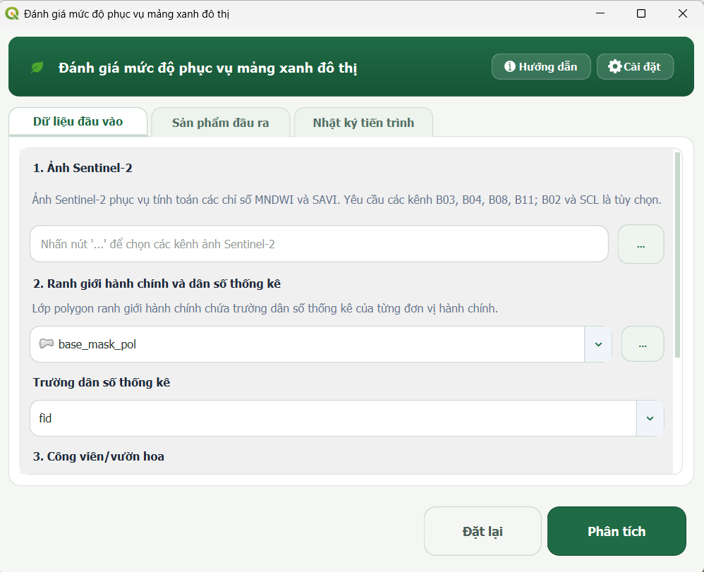
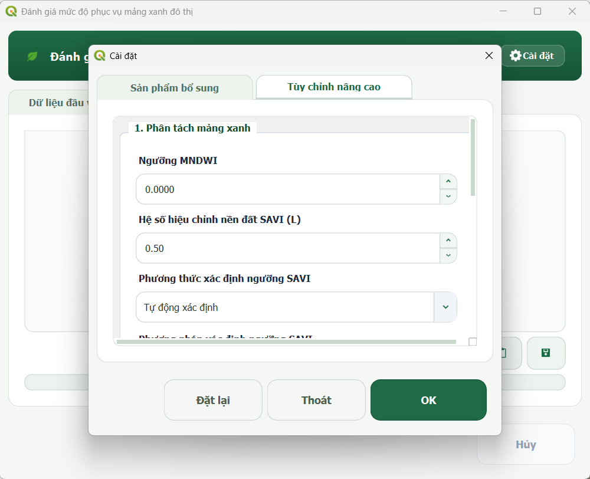
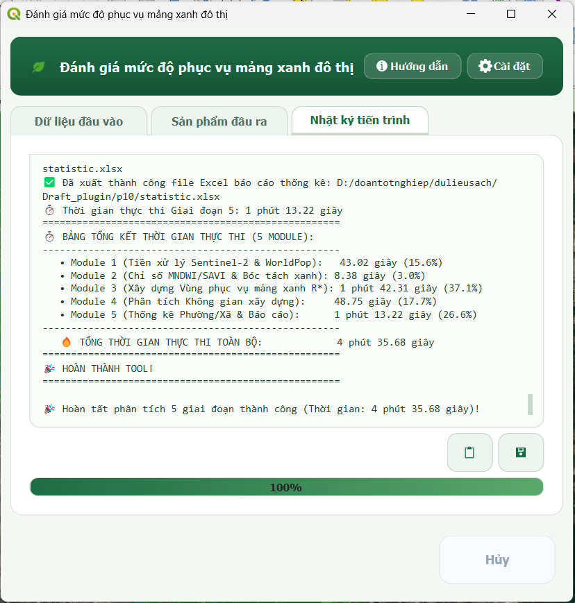

# HƯỚNG DẪN SỬ DỤNG PLUGIN GREEN SPACE EVALUATOR

> **Đồ án tốt nghiệp:** Xây dựng Plugin trên QGIS hỗ trợ tự động hóa đánh giá mức độ phục vụ của mảng xanh đô thị  
> **Sinh viên thực hiện:** Huỳnh Hoàng Xuân Phi  
> **Đơn vị:** Khoa Trắc địa, Bản đồ và Công trình – Trường Đại học Tài nguyên và Môi trường TP. Hồ Chí Minh  
> **Năm thực hiện:** 2026

---

## 1. Giới thiệu

**Green Space Evaluator** là Plugin chạy trên nền tảng QGIS, hỗ trợ tự động hóa quy trình xử lý ảnh Sentinel-2, trích xuất mảng xanh đô thị, mô hình hóa vùng phục vụ theo khoảng cách Euclid, phân tích không gian xây dựng và tổng hợp kết quả thống kê theo đơn vị hành chính.

Plugin cho phép người dùng thay đổi các tham số phân tích để phù hợp với khu vực và mục đích nghiên cứu. Trong thử nghiệm của đồ án tại khu vực Biên Hòa, một số giá trị mặc định được lựa chọn có **tham chiếu QCVN 01:2021/BXD**, gồm bán kính phục vụ tối đa 300 m, sức tải mục tiêu 6 m²/người và ngưỡng lọc diện tích 5000 m². Đây là các giá trị mặc định phục vụ thử nghiệm, không giới hạn Plugin chỉ sử dụng cho QCVN 01:2021/BXD.

Quy trình của Plugin gồm 5 module:

1. Tiền xử lý dữ liệu Sentinel-2 và WorldPop.
2. Tính MNDWI, SAVI và trích xuất mảng xanh đô thị.
3. Tính khoảng cách Euclid và xác định bán kính phục vụ lớn nhất thỏa điều kiện sức tải.
4. Phân tích không gian xây dựng nằm trong và ngoài vùng phục vụ.
5. Thống kê kết quả theo đơn vị hành chính và xuất bảng dữ liệu.

---

## 2. Cài đặt Plugin

### Cách 1. Cài đặt từ file ZIP

1. Mở **QGIS**.
2. Chọn **Plugins → Manage and Install Plugins**.
3. Chuyển sang mục **Install from ZIP**.
4. Chọn file ZIP chứa Plugin **Green Space Evaluator**.
5. Nhấn **Install Plugin**.
6. Sau khi cài đặt, kiểm tra Plugin đã được bật trong danh sách Plugin của QGIS.

### Cách 2. Cài đặt thủ công

Giải nén thư mục `green_space_evaluator` vào thư mục Plugin của QGIS, sau đó khởi động lại QGIS và bật Plugin trong **Manage and Install Plugins**.

Sau khi cài đặt thành công, Plugin có thể được mở từ menu **Plugins** hoặc biểu tượng chiếc lá trên thanh công cụ QGIS.

---

## 3. Dữ liệu đầu vào

Trong tab **Dữ liệu đầu vào**, người dùng cung cấp 5 nhóm dữ liệu:

| STT | Dữ liệu | Kiểu dữ liệu | Vai trò |
|---|---|---|---|
| 1 | Các kênh ảnh Sentinel-2 | Raster | Tính MNDWI, SAVI và trích xuất thực vật |
| 2 | Raster dân số WorldPop | Raster | Ước tính dân số trong vùng nghiên cứu và vùng phục vụ |
| 3 | Vector khu vực nghiên cứu | Polygon | Giới hạn phạm vi xử lý và đơn vị không gian nghiên cứu |
| 4 | Vector công viên/vườn hoa | Polygon | Cung cấp vùng mẫu để xác định ngưỡng SAVI và hỗ trợ xử lý mảng xanh |
| 5 | Vector dấu vết công trình xây dựng | Polygon | Đại diện cho không gian xây dựng và giới hạn phạm vi phân bố của raster dân số |

Đối với Sentinel-2, quy trình phân tích yêu cầu bắt buộc các kênh **B03, B04, B08, B11**; các kênh **B02** (hỗ trợ tạo ảnh True Color RGB) và **SCL** (hỗ trợ lọc mây, bóng mây và các pixel không phù hợp trước khi tính chỉ số phổ) là **tùy chọn**.

Vector khu vực nghiên cứu nên sử dụng hệ tọa độ phẳng phù hợp với khu vực nghiên cứu. Trong đồ án thử nghiệm tại Biên Hòa, dữ liệu được chuẩn hóa về hệ tọa độ VN-2000.

---

## 4. Cài đặt tham số

Nhấn nút **Cài đặt** trên giao diện chính để mở cửa sổ cấu hình.

| Tham số | Giá trị mặc định | Ý nghĩa |
|---|---:|---|
| Ngưỡng MNDWI | 0,0 | Ngưỡng nhận diện pixel mặt nước |
| Hệ số L của SAVI | 0,5 | Hệ số hiệu chỉnh ảnh hưởng nền đất |
| Ngưỡng SAVI | -999 | Chế độ tự động xác định ngưỡng từ mẫu công viên |
| Phương pháp thống kê SAVI | P10 | Bách phân vị 10% được dùng làm giá trị mặc định thử nghiệm |
| Bách phân vị tùy chỉnh | 10% | Chỉ sử dụng khi chọn chế độ bách phân vị tùy chỉnh |
| Diện tích mảng xanh lọc nhiễu tối thiểu | 5000 m² | Ngưỡng kỹ thuật dùng cho các cụm mảng xanh ngoài công viên |
| Bán kính phục vụ tối đa | 300 m | Giới hạn trên của miền tìm kiếm bán kính |
| Sức tải mảng xanh mục tiêu | 6 m²/người | Ngưỡng sức tải dùng trong quá trình xác định bán kính phục vụ |
| Sai số hội tụ | 10 m | Điều kiện dừng của quá trình tìm kiếm nhị phân |

### Các giá trị tham chiếu QCVN trong thử nghiệm của đồ án

Trong cấu hình mặc định phục vụ thử nghiệm tại Biên Hòa:

- **300 m** được sử dụng làm bán kính phục vụ tối đa, có tham chiếu quy định về bán kính phục vụ của vườn hoa, sân chơi trong nhóm nhà ở.
- **6 m²/người** được sử dụng làm ngưỡng sức tải tham chiếu ở cấp đô thị.
- **5000 m²** được sử dụng làm ngưỡng kỹ thuật thử nghiệm để lọc các cụm mảng xanh nhỏ, có tham chiếu quy mô tối thiểu của công viên, vườn hoa trong đơn vị ở.

Người dùng có thể thay đổi các giá trị này trong cửa sổ **Cài đặt** khi áp dụng Plugin cho mục đích hoặc khu vực nghiên cứu khác.

Ngoài các tham số trên, người dùng có thể chỉ định đường dẫn lưu các sản phẩm trung gian như raster MNDWI, SAVI, mặt nước, thực vật, raster dân số đã chuẩn hóa và các biểu đồ Histogram. Nếu không cần lưu các sản phẩm trung gian, có thể để trống các trường này.

### Hình minh họa giao diện và kết quả Plugin

  <figure style="margin:0;padding:10px;border:1px solid #e5e7eb;border-radius:10px;background:#fafafa;">
    
    <figcaption style="margin-top:8px;font-size:14px;color:#374151;text-align:center;">
      Hình 1. Giao diện chính của Plugin Green Space Evaluator
    </figcaption>
  </figure>

  <figure style="margin:0;padding:10px;border:1px solid #e5e7eb;border-radius:10px;background:#fafafa;">
    
    <figcaption style="margin-top:8px;font-size:14px;color:#374151;text-align:center;">
      Hình 2. Cửa sổ cài đặt nâng cao của Plugin
    </figcaption>
  </figure>

  <figure style="margin:0;padding:10px;border:1px solid #e5e7eb;border-radius:10px;background:#fafafa;">
    
    <figcaption style="margin-top:8px;font-size:14px;color:#374151;text-align:center;">
      Hình 3. Kết quả phân tích Plugin.
    </figcaption>
  </figure>

---

## 5. Thiết lập sản phẩm đầu ra

Trong tab **Sản phẩm đầu ra**, người dùng có thể chỉ định đường dẫn lưu 5 sản phẩm chính:

1. Raster mảng xanh đô thị.
2. Vector vùng phục vụ tương ứng với bán kính xác định được.
3. Vector không gian xây dựng nằm trong vùng phục vụ.
4. Vector không gian xây dựng nằm ngoài vùng phục vụ.
5. Vector thống kê theo đơn vị hành chính.

Nếu để trống đường dẫn, Plugin sử dụng đầu ra tạm thời trong phiên làm việc QGIS.

---

## 6. Chạy phân tích

1. Nạp đầy đủ 5 nhóm dữ liệu trong tab **Dữ liệu đầu vào**.
2. Mở **Cài đặt** nếu cần thay đổi tham số hoặc đường dẫn sản phẩm trung gian.
3. Chuyển sang tab **Sản phẩm đầu ra** và chọn nơi lưu các sản phẩm cần thiết.
4. Nhấn **Phân tích**.
5. Theo dõi tiến trình trong tab **Nhật ký tiến trình**.
6. Sau khi hoàn tất, kiểm tra các lớp kết quả được nạp vào QGIS và các file đã được lưu tại đường dẫn đã chọn.

Trong Module 3, Plugin tính ma trận khoảng cách Euclid từ mảng xanh và đánh giá sức tải theo bán kính. Hai biên của miền tìm kiếm được kiểm tra trước; khi cần thiết, thuật toán tìm kiếm nhị phân được sử dụng để xác định bán kính lớn nhất mà sức tải vẫn đạt ngưỡng mục tiêu. Nếu không tồn tại bán kính thỏa điều kiện trong miền tìm kiếm, thông tin tương ứng được ghi trong nhật ký tiến trình.

---

## 7. Sản phẩm và chỉ tiêu thống kê

Các sản phẩm trung gian có thể gồm ảnh Sentinel-2 đã chuẩn hóa, raster dân số, MNDWI, SAVI, mặt nước, thực vật, Histogram và raster dân số trong không gian xây dựng.

Các sản phẩm chính gồm raster mảng xanh đô thị, vector vùng phục vụ, vector không gian xây dựng trong/ngoài vùng phục vụ và vector thống kê theo đơn vị hành chính.

Bảng thống kê của Plugin sử dụng 6 trường chính:

| Trường | Nội dung |
|---|---|
| `T_DanSo` | Tổng dân số ước tính của đơn vị hành chính |
| `S_MangXanh` | Diện tích mảng xanh đô thị (ha) |
| `S_XayDung` | Diện tích không gian xây dựng (ha) |
| `S_ThieuXanh` | Diện tích không gian xây dựng nằm ngoài vùng phục vụ (ha) |
| `D_ThieuXanh` | Dân số ước tính nằm ngoài vùng phục vụ (người) |
| `TL_ThieuXanh` | Tỷ lệ dân số ước tính nằm ngoài vùng phục vụ (%) |

Plugin hỗ trợ xuất bảng thống kê dưới định dạng **Excel (.xlsx)** hoặc **CSV (.csv)**.

---

## 8. Lưu ý khi sử dụng

- Vùng phục vụ của Plugin được mô hình hóa theo **khoảng cách Euclid**, không phải khoảng cách di chuyển theo mạng lưới giao thông.
- Mảng xanh trích xuất từ ảnh vệ tinh được hiểu là **mảng xanh về mặt lớp phủ bề mặt**.
- Vector dấu vết công trình xây dựng được sử dụng như lớp đại diện cho **không gian xây dựng**.
- Các tham số mặc định có thể được điều chỉnh tùy theo mục tiêu nghiên cứu; các giá trị 300 m, 6 m²/người và 5000 m² trong cấu hình thử nghiệm của đồ án được lựa chọn có tham chiếu QCVN 01:2021/BXD.

---

## 9. Thông tin tác giả

**Huỳnh Hoàng Xuân Phi**  
Khoa Trắc địa, Bản đồ và Công trình  
Trường Đại học Tài nguyên và Môi trường TP. Hồ Chí Minh  
Năm 2026
