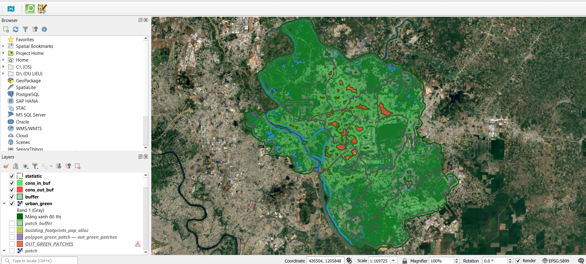

# Sản phẩm và chỉ tiêu thống kê

Sau khi hoàn tất quy trình phân tích, Plugin **Green Space Evaluator** sẽ tạo ra **5 sản phẩm đầu ra chính**, tùy chọn **bảng báo cáo thống kê** (Excel/CSV) cùng hệ thống **sản phẩm bổ sung** phục vụ kiểm tra và nghiên cứu chuyên sâu. Trang này cung cấp thông tin chi tiết về cấu trúc dữ liệu, ý nghĩa các trường thuộc tính thống kê và hướng dẫn diễn giải kết quả.

<strong>Hình 3.</strong> Các sản phẩm chính sau khi chạy Plugin.

---

## 1. 5 sản phẩm đầu ra chính

Năm sản phẩm chính được cấu hình tại thẻ **Sản phẩm đầu ra** trên giao diện Plugin:

| STT | Tên sản phẩm | Loại dữ liệu | Định dạng hỗ trợ | Nội dung & Vai trò kỹ thuật |
|---|---|---|---|---|
| **1** | **Mảng xanh đô thị** | Raster | `.tif` (GeoTIFF) | Lớp raster thể hiện phân bố thảm thực vật mảng xanh sau khi phân loại chỉ số phổ, loại trừ mặt nước và lọc diện tích tối thiểu $A_{\min} = 5000\text{ m}^2$. |
| **2** | **Vùng phục vụ mảng xanh** | Vector (Polygon) | `.gpkg`, `.shp`, `.geojson` | Vùng phục vụ chung (`SERVICE_UNION`) được tạo bằng cách hợp nhất các vùng phục vụ riêng của từng mảng xanh theo bán kính khả thi $R^*$. Các phần chồng lấn chỉ được tính một lần. |
| **3** | **Không gian xây dựng trong vùng phục vụ** | Vector (Polygon) | `.gpkg`, `.shp`, `.geojson` | Các phần diện tích không gian xây dựng (`SERVED`) nằm trong vùng phục vụ chung. Mỗi phần diện tích mang trường dân số `POP_FRAGMENT` được phân bổ từ `SOURCE_POP_ALLOC` theo tỷ lệ diện tích. |
| **4** | **Không gian xây dựng ngoài vùng phục vụ** | Vector (Polygon) | `.gpkg`, `.shp`, `.geojson` | Các phần diện tích không gian xây dựng (`OUTSIDE`) nằm ngoài vùng phục vụ chung trong phạm vi phân tích. |
| **5** | **Thống kê kết quả theo đơn vị hành chính** | Vector (Polygon) | `.gpkg`, `.shp`, `.geojson` | Lớp ranh giới dạng Vector tích hợp 10 trường chỉ số định lượng đánh giá toàn diện mức độ phục vụ mảng xanh theo từng đơn vị hành chính. |

---

## 2. Chi tiết từng sản phẩm chính

### 2.1. Mảng xanh đô thị (`OUT_PARK`)
- **Bản chất dữ liệu**: Lớp raster nhị phân (1: Mảng xanh, 0: Khác) thể hiện thảm thực vật mảng xanh sau khi bóc tách bằng chỉ số SAVI (ngưỡng 0.165, $L = 0.50$), loại trừ mặt nước (MNDWI > 0.000) và lọc bỏ các mảng nhỏ dưới $5000\text{ m}^2$.
- **Vai trò kỹ thuật**: Đóng vai trò là nguồn phát mảng xanh để tính diện tích $S_i$ và xây dựng vùng đệm phục vụ cho từng mảng xanh.
- **Lưu ý**: Lớp dữ liệu thể hiện hiện trạng thảm thực vật phản xạ phổ tại thời điểm chụp ảnh Sentinel-2, không đồng nhất hoàn toàn với diện tích đất cây xanh quy hoạch theo hồ sơ pháp lý.

### 2.2. Vùng phục vụ mảng xanh (`OUT_SERVICE_UNION`)
- **Bản chất dữ liệu**: Lớp vector polygon vùng phục vụ chung (`SERVICE_UNION`), được tạo bằng cách hợp nhất (`unaryUnion`) các vùng phục vụ riêng của từng mảng xanh theo bán kính khả thi $R^*$.
- **Đặc điểm quan trọng**:
    - `SERVICE_UNION` đại diện cho toàn bộ phạm vi dịch vụ của mạng lưới mảng xanh trong đô thị.
    - Các phần diện tích chồng lấn giữa nhiều vùng phục vụ riêng được hợp nhất và **chỉ tính đúng một lần**, loại bỏ hoàn toàn hiện tượng đếm lặp dân số và diện tích phục vụ.

### 2.3. Không gian xây dựng trong vùng phục vụ (`OUT_SERVED_RES`)
- **Bản chất dữ liệu**: Tập hợp các phần diện tích không gian xây dựng (`SERVED`) nằm bên trong vùng phục vụ chung `SERVICE_UNION`.
- **Cơ chế phân bổ dân số**: Mỗi phần diện tích mang trường `POP_FRAGMENT` được phân bổ từ dân số nguồn `SOURCE_POP_ALLOC` theo tỷ lệ diện tích: $\text{POP_FRAGMENT} = \text{SOURCE_POP_ALLOC} \times \frac{\text{AREA_M2}}{\text{SOURCE_AREA_M2}}$.
- **Ý nghĩa**: Đại diện cho không gian xây dựng vật lý được tiếp cận dịch vụ mảng xanh theo mô hình khoảng cách hình học và chỉ tiêu diện tích mảng xanh tối thiểu ($C_{\min}$).

### 2.4. Không gian xây dựng ngoài vùng phục vụ (`OUT_AFF_RES`)
- **Bản chất dữ liệu**: Tập hợp các phần diện tích không gian xây dựng (`OUTSIDE`) nằm ngoài vùng phục vụ chung `SERVICE_UNION` trong phạm vi phân tích.
- **Ý nghĩa**: Thể hiện các khu vực xây dựng còn thiếu hụt không gian xanh theo tiêu chí khoảng cách và chỉ tiêu diện tích mảng xanh bình quân đầu người tối thiểu ($C_{\min}$) của mô hình, hỗ trợ định hướng các vị trí ưu tiên bổ sung công viên, mảng xanh mới.

### 2.5. Thống kê kết quả theo đơn vị hành chính (`OUT_STATS`)
- **Bản chất dữ liệu**: Lớp vector ranh giới hành chính (phường/xã) kế thừa cấu trúc hình học từ lớp ranh giới đầu vào, được tích hợp trực tiếp 10 trường chỉ số định lượng.
- **Phương pháp tổng hợp**: Tổng hợp trực tiếp từ các lớp vector kết quả hình học và số liệu phân bổ không gian.

---

## 3. Bảng báo cáo thống kê bổ sung (CSV / XLSX)

### 3.1. Bảng thống kê theo đơn vị hành chính
- **Định dạng hỗ trợ**: **Excel (`.xlsx`)** hoặc **CSV (`.csv`)**.
- **Cấu trúc dữ liệu**: Mỗi hàng tương ứng với một đơn vị hành chính và chứa đầy đủ 10 trường chỉ số định lượng.
- **Chuẩn mã hóa**: Tệp `.csv` được xuất dưới định dạng mã hóa `UTF-8-SIG`, đảm bảo mở trực tiếp bằng Microsoft Excel hiển thị tiếng Việt chuẩn xác không bị lỗi phông chữ.

### 3.2. Bảng thống kê chi tiết theo mảng xanh (`OUT_PATCH_STATS`)

Tệp thống kê chi tiết ở cấp độ từng mảng xanh gồm các trường thông tin chuẩn hóa:

- `PATCH_ID`: Mã định danh số nguyên duy nhất của từng mảng xanh.
- `AREA_M2`, `AREA_HA`: Diện tích mảng xanh ($\text{m}^2$ và ha).
- `P_MAX`: Dân số phục vụ tối đa theo diện tích: $P_{\max, i} = S_i / C_{\min}$.
- `P_RMIN`: Dân số phân bổ tiếp cận tại $R = 0\text{ m}$.
- `P_RMAX`: Dân số phân bổ tiếp cận tại $R = R_{\max}$.
- `R_STAR`: Bán kính phục vụ khả thi tìm được (m).
- `STATUS`: Trạng thái giải nghiệm (`RMAX`, `BINARY_SEARCH`, `NO_SOLUTION`).
- `P_AT_RSTAR`: Dân số thực tế nằm trong vùng phục vụ riêng của mảng xanh ứng với bán kính $R^*$.
- `POP_GAP`: Độ lệch giữa dân số trần và dân số phục vụ thực tế ($P_{\max, i} - P_{\text{at_rstar}}$).
- `POP_BRACKET`: Khoảng chênh lệch dân số giữa hai cận khi kết thúc tìm kiếm ($P_{\text{high}} - P_{\text{low}}$).
- `ITERATIONS`: Số vòng lặp tinh chỉnh nhị phân.

---

## 4. 10 trường thuộc tính thống kê hành chính

Bảng thuộc tính của lớp vector thống kê hành chính chứa đúng **10 trường chỉ số định lượng chuẩn hóa**:

| STT | Tên trường | Nội dung chỉ số | Đơn vị | Kiểu dữ liệu | Ý nghĩa & Bản chất khoa học |
|---|---|---|:---:|:---:|---|
| 1 | `T_DanSo` | Tổng dân số thống kê của đơn vị hành chính | người | Integer | Dân số thống kê chính thức của đơn vị hành chính (`POP_STAT`). |
| 2 | `S_MangXanh` | Tổng diện tích mảng xanh phân bổ cho đơn vị hành chính | ha | Double (3) | Tổng diện tích mảng xanh được phân bổ cho đơn vị hành chính theo tỷ trọng diện tích giao cắt của từng mảng xanh với ranh giới hành chính. |
| 3 | `S_XayDung` | Tổng diện tích không gian xây dựng | ha | Double (3) | Tổng diện tích các phần dấu vết công trình nằm trong đơn vị hành chính. |
| 4 | `S_DaPhucVu` | Diện tích không gian xây dựng được phục vụ | ha | Double (3) | Tổng diện tích các phần diện tích xây dựng nằm trong vùng phục vụ mảng xanh chung (`SERVICE_UNION`). |
| 5 | `S_ThieuXanh` | Diện tích không gian xây dựng thiếu mảng xanh | ha | Double (3) | Tổng diện tích các phần diện tích xây dựng nằm ngoài vùng phục vụ mảng xanh chung. |
| 6 | `D_DaPhucVu` | Dân số phân bổ được phục vụ mảng xanh | người | Integer | Tổng dân số phân bổ (`POP_FRAGMENT`) của các phần diện tích xây dựng nằm trong vùng phục vụ mảng xanh chung. |
| 7 | `D_ThieuXanh` | Dân số phân bổ thiếu mảng xanh | người | Integer | Tổng dân số phân bổ (`POP_FRAGMENT`) của các phần diện tích xây dựng nằm ngoài vùng phục vụ mảng xanh chung. |
| 8 | `TL_DaPhucVu` | Tỷ lệ dân số phân bổ được phục vụ | % | Double (3) | Tỷ lệ phần trăm dân số phân bổ được phục vụ so với tổng dân số của đơn vị hành chính. |
| 9 | `TL_ThieuXanh` | Tỷ lệ dân số phân bổ thiếu mảng xanh | % | Double (3) | Tỷ lệ phần trăm dân số phân bổ nằm ngoài vùng phục vụ so với tổng dân số của đơn vị hành chính. |
| 10 | `N_Mang_DuocPhucVu` | Số lượng mảng xanh có vùng phục vụ giao cắt | mảng | Integer | Số lượng mảng xanh có vùng phục vụ riêng (`OUT_BUFFER`) giao cắt với ranh giới của đơn vị hành chính. |

---

## 5. Công thức tính toán các chỉ tiêu

Các chỉ tiêu thống kê được tính toán tuần tự theo các công thức khoa học sau:

### 5.1. Cân bằng diện tích xây dựng
Tổng diện tích xây dựng của đơn vị hành chính là tổng diện tích của phần được phục vụ và phần thiếu xanh:

$$
S_{\text{XayDung}} = S_{\text{DaPhucVu}} + S_{\text{ThieuXanh}}
$$

### 5.2. Cân bằng dân số phân bổ
Tổng dân số thống kê của đơn vị hành chính bằng tổng dân số phân bổ được phục vụ và dân số phân bổ thiếu xanh:

$$
T_{\text{DanSo}} = D_{\text{DaPhucVu}} + D_{\text{ThieuXanh}}
$$

### 5.3. Tỷ lệ dân số phân bổ được phục vụ và thiếu mảng xanh

$$
TL_{\text{DaPhucVu}} = \frac{D_{\text{DaPhucVu}}}{T_{\text{DanSo}}} \times 100
$$

$$
TL_{\text{ThieuXanh}} = \frac{D_{\text{ThieuXanh}}}{T_{\text{DanSo}}} \times 100
$$

Trong đó:

$$
TL_{\text{DaPhucVu}} + TL_{\text{ThieuXanh}} = 100\%
$$

---

## 6. Sản phẩm bổ sung

Khi người dùng cấu hình đường dẫn lưu tại tab **Sản phẩm bổ sung** trong cửa sổ Cài đặt, Plugin có thể xuất thêm các tệp sau:

| Sản phẩm bổ sung | Định dạng | Vai trò kỹ thuật |
|---|---|---|
| **Vùng phục vụ riêng của từng mảng xanh (`OUT_BUFFER`)** | Vector (`.gpkg`) | Vùng phục vụ độc lập của từng mảng xanh theo $R^*$, phục vụ tạo `SERVICE_UNION` và đối soát chi tiết. |
| **Ảnh Sentinel-2 Stack** | Raster (`.tif`) | Ảnh đa kênh ghép gồm các kênh bắt buộc và tùy chọn cắt theo ranh giới, độ phân giải 10 m. |
| **Raster MNDWI** | Raster (`.tif`) | Ảnh chỉ số khác biệt nước cải tiến. |
| **Raster mặt nước** | Raster (`.tif`) | Mặt nạ nhị phân thể hiện bề mặt nước sông, suối, hồ kênh rạch. |
| **Raster SAVI** | Raster (`.tif`) | Ảnh chỉ số thực vật điều chỉnh theo đất trên toàn cảnh. |
| **Raster SAVI (loại bỏ nước)** | Raster (`.tif`) | Chỉ số SAVI trên đất liền sau khi đã trừ mặt nạ nước. |
| **Raster thực vật** | Raster (`.tif`) | Mặt nạ thảm thực vật ban đầu trước khi áp dụng bộ lọc diện tích tối thiểu. |
| **Vector mảng xanh đô thị** | Vector (`.gpkg`) | Lớp vector polygon các mảng xanh sau khi vector hóa. |
| **Biểu đồ Histogram MNDWI & SAVI** | Ảnh (`.png`) | Biểu đồ phân bố tần suất giá trị phổ hỗ trợ đánh giá độ tin cậy của ngưỡng bóc tách. |
| **Bảng thống kê mảng xanh** | File (`.xlsx`/`.csv`) | Bảng thuộc tính chi tiết từng mảng xanh: diện tích, bán kính $R^*$, trạng thái, dân số tiếp cận. |

---

## 7. Lưu ý khi diễn giải kết quả

!!! warning "Lưu ý phương pháp luận khi đọc kết quả"
    1. **Bản chất dân số:** Các chỉ tiêu `D_DaPhucVu`, `D_ThieuXanh`, `TL_ThieuXanh` là giá trị **dân số được phân bổ theo không gian** từ số liệu thống kê cấp hành chính dựa trên diện tích dấu vết công trình. Không được diễn giải đây là số lượng cư dân điều tra thực địa hay số hộ gia đình thực tế.
    2. **Khái niệm phục vụ:** Thuật ngữ "được phục vụ" hoặc "thiếu mảng xanh" phản ánh kết quả mô hình hóa không gian bằng khoảng cách hình học và chỉ tiêu diện tích mảng xanh bình quân đầu người tối thiểu ($C_{\min}$) của mô hình; không đồng nhất hoàn toàn với việc người dân có tiếp cận được không gian xanh trên thực tế hay không (do phụ thuộc vào mạng lưới đường đi, lối vào công viên và rào chắn thực địa).
